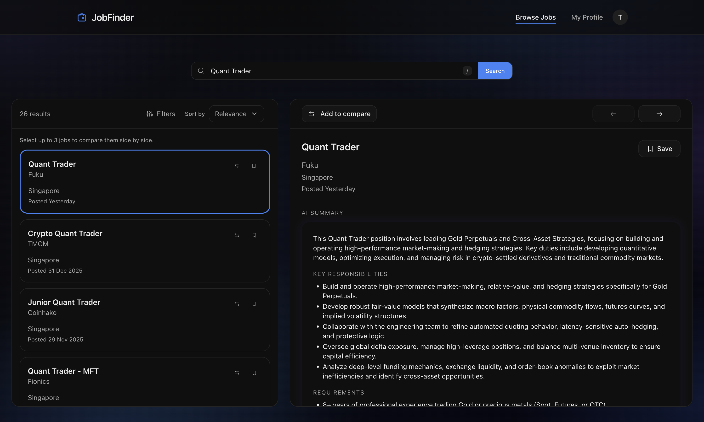

# 💼 Job Finder App



AI-assisted job search built with Next.js. Browse listings from the Adzuna API, save jobs,
compare up to 3 roles side by side, and generate AI summaries powered by Gemini.
Admins manage users, listings, and summaries from a dedicated dashboard.

**✨ Core features**

- **Browse & search** — Job listings from the Adzuna API (20+ countries); keyword search, filters, trending and recommended sections
- **Compare jobs** — Select 2–3 roles and get a unified AI comparison (similarities, differences, recommendation, match scores)
- **AI summaries** — Gemini-powered TL;DR, key responsibilities, requirements, and optional JD–skillset match per listing
- **Profile & skills** — Store skills and job titles; AI skill suggestions and resume parsing (PDF/DOCX) to prefill your profile
- **Admin dashboard** — Manage users, listings, and summaries; stream AI dashboard summary; admin-only settings

## 📑 Table of contents

- [Tech Stack](#-tech-stack)
- [Monorepo Layout](#-monorepo-layout)
- [React Component Tree](#-react-component-tree)
- [API Routes](#-api-routes)
- [Database Schemas](#-database-schemas)
  - [User](#-user)
  - [UserProfile](#-userprofile)
  - [Listing](#-listing)
  - [SearchCache](#-searchcache)
  - [AISummary](#-aisummary)
  - [SavedListing](#-savedlisting)
  - [ListingView](#-listingview)
- [Useful Scripts](#-useful-scripts)
- [Environment Variables](#-environment-variables)
- [Cache Duration](#-cache-duration)
- [Getting Started](#-getting-started)
- [Next Steps](#-next-steps)

## 🛠️ Tech Stack

| Layer             | Technology                                                                  |
| ----------------- | --------------------------------------------------------------------------- |
| **Framework**     | Next.js 16 (App Router), React 19, TypeScript                               |
| **Database**      | MongoDB + Mongoose                                                          |
| **Data fetching** | TanStack Query (React Query)                                                |
| **Validation**    | Zod (shared schemas in `packages/schemas`)                                  |
| **UI**            | Tailwind CSS 4.0 (dark mode default), shadcn/ui (`packages/ui`)             |
| **Icons**         | @phosphor-icons/react                                                       |
| **Animations**    | framer-motion                                                               |
| **AI**            | Google Gemini (via `ai` SDK) — summaries, resume parsing, skill suggestions |
| **External data** | Adzuna API — job listings for 20+ countries                                 |

## 📁 Monorepo Layout

```
Job-Finder-App/
├── next-app/             # Next.js application
│   ├── app/              #   Pages and API routes (App Router)
│   ├── components/       #   React components
│   ├── contexts/         #   AuthContext, CompareContext
│   ├── hooks/            #   useSavedListings, useIsMdViewport
│   └── lib/              #   Services, models, API client, auth, utilities
├── packages/
│   ├── schemas/          # Shared Zod schemas and inferred TypeScript types
│   └── ui/               # Shared UI components (Button, Card, Dialog, Input, Label, Select)
└── package.json          # Root workspace config (pnpm Workspaces)
```

## 🌳 React Component Tree


## 🔌 API Routes

All routes are under `/api/v1/`. Protected routes require a Bearer token; admin routes also require `role: "admin"`.

| Route                             | Methods            | Auth      | Description                                                                         |
| --------------------------------- | ------------------ | --------- | ----------------------------------------------------------------------------------- |
| `/auth/login`                     | POST               | —         | Log in (email or username + password)                                               |
| `/auth/register`                  | POST               | —         | Create account                                                                      |
| `/auth/refresh`                   | POST               | Cookie    | Rotate access + refresh tokens                                                      |
| `/auth/logout`                    | POST               | —         | Clear refresh cookie                                                                |
| `/auth/admin/register`            | POST               | Admin     | Create admin user                                                                   |
| `/users`                          | GET                | Admin     | List users                                                                          |
| `/users/me`                       | GET                | Auth      | Current user                                                                        |
| `/users/:id`                      | GET, PATCH, DELETE | Auth      | User by ID (own or admin); DELETE = delete own account                              |
| `/profile`                        | GET, PUT           | Auth      | User profile (skills, job titles, resume summary)                                   |
| `/profile/suggest-skills`         | POST               | Auth      | AI skill suggestions from role                                                      |
| `/resume/parse`                   | POST               | Auth      | Parse resume (PDF, DOCX, or text) via AI                                            |
| `/listings`                       | GET, POST          | — / Admin | Search listings; POST = create listing (admin only)                                 |
| `/listings/:id`                   | GET, PATCH, DELETE | — / Admin | Single listing; PATCH/DELETE = update/delete (admin)                                |
| `/listings/:id/view`              | POST               | —         | Record a view                                                                       |
| `/listings/categories`            | GET                | —         | Categories by country                                                               |
| `/listings/trending`              | GET                | —         | Trending listings                                                                   |
| `/listings/recommended`           | GET                | Auth      | Recommended listings                                                                |
| `/saved`                          | GET, POST          | Auth      | List saved listings; POST = save a listing                                          |
| `/saved/:listingId`               | DELETE             | Auth      | Unsave a listing                                                                    |
| `/saved/check`                    | GET                | Auth      | Check if listings are saved                                                         |
| `/summaries`                      | GET, POST          | Auth      | List / create AI summary                                                            |
| `/summaries/:id`                  | GET, DELETE        | Auth      | Get / delete summary                                                                |
| `/summaries/compare`              | POST               | Auth      | Compare 2–3 listings via AI (non-stream)                                            |
| `/summaries/compare/stream`       | POST               | Auth      | Stream comparison of 2–3 listings via AI                                            |
| `/summaries/stream`               | POST               | Auth      | Stream AI summary (cache hit returns JSON)                                          |
| `/admin/dashboard`                | GET                | Admin     | Dashboard metrics                                                                   |
| `/admin/dashboard/summary/stream` | POST               | Admin     | Stream AI dashboard summary                                                         |
| `/admin/users`                    | GET                | Admin     | User management                                                                     |
| `/admin/users/:id`                | GET, PATCH, DELETE | Admin     | User detail; DELETE = delete user                                                   |
| `/admin/users/:id/role`           | PATCH              | Admin     | Change user role                                                                    |
| `/admin/users/:id/status`         | PATCH              | Admin     | Suspend / activate                                                                  |
| `/admin/summaries`                | GET                | Admin     | All summaries                                                                       |
| `/admin/summaries/:id`            | DELETE             | Admin     | Delete summary by ID                                                                |
| `/admin/listings`                 | GET                | Admin     | List listings (create/update/delete use POST /listings, PATCH/DELETE /listings/:id) |

## 🗄️ Database Schemas

MongoDB collections (Mongoose models in `next-app/lib/models/`). Zod schemas in `packages/schemas` define the contract; Mongoose schemas align with them.

### 👤 User

| Field     | Type                        | Optional                  |
| --------- | --------------------------- | ------------------------- |
| email     | String                      | no                        |
| username  | String                      | no                        |
| password  | String                      | no                        |
| role      | `"user"` \| `"admin"`       | yes (default: `"user"`)   |
| status    | `"active"` \| `"suspended"` | yes (default: `"active"`) |
| createdAt | Date                        | no (auto)                 |
| updatedAt | Date                        | no (auto)                 |

Index: `email` + `role` (unique).

### 📋 UserProfile

| Field             | Type                 | Optional            |
| ----------------- | -------------------- | ------------------- |
| userId            | ObjectId (ref: User) | no                  |
| skills            | String[]             | yes (default: `[]`) |
| jobTitles         | String[]             | yes (default: `[]`) |
| resumeSummary     | String               | yes                 |
| yearsOfExperience | Number               | yes                 |
| updatedAt         | Date                 | no (auto)           |

### 📄 Listing

| Field       | Type   | Optional                  |
| ----------- | ------ | ------------------------- |
| title       | String | no                        |
| company     | String | no                        |
| location    | String | yes                       |
| description | String | yes                       |
| source      | String | yes (default: `"adzuna"`) |
| sourceUrl   | String | yes                       |
| sourceId    | String | no                        |
| country     | String | no (default: `"sg"`)      |
| expiresAt   | Date   | no                        |
| postedAt    | Date   | yes                       |
| salaryMin   | Number | yes                       |
| salaryMax   | Number | yes                       |
| createdAt   | Date   | no (auto)                 |
| updatedAt   | Date   | no (auto)                 |

Indexes: `sourceId` + `country` (unique); TTL on `expiresAt`.

### 💾 SearchCache

| Field      | Type                      | Optional        |
| ---------- | ------------------------- | --------------- |
| cacheKey   | String                    | no              |
| listingIds | ObjectId[] (ref: Listing) | yes             |
| totalCount | Number                    | no (default: 0) |
| expiresAt  | Date                      | no              |
| createdAt  | Date                      | no (auto)       |

Indexes: `cacheKey` (unique); TTL on `expiresAt`.

### 🤖 AISummary

| Field               | Type                                            | Optional  |
| ------------------- | ----------------------------------------------- | --------- |
| userId              | ObjectId (ref: User)                            | no        |
| inputTextHash       | String                                          | no        |
| tldr                | String                                          | no        |
| keyResponsibilities | String[]                                        | yes       |
| requirements        | String[]                                        | yes       |
| niceToHaves         | String[]                                        | yes       |
| salarySgd           | String                                          | yes       |
| jdMatch             | { matchScore?, matchedSkills?, missingSkills? } | yes       |
| caveats             | String[]                                        | yes       |
| createdAt           | Date                                            | no (auto) |
| updatedAt           | Date                                            | no (auto) |

Indexes: `inputTextHash` + `userId`; `userId`.

### 🔖 SavedListing

| Field     | Type                    | Optional  |
| --------- | ----------------------- | --------- |
| userId    | ObjectId (ref: User)    | no        |
| listingId | ObjectId (ref: Listing) | no        |
| title     | String                  | no        |
| company   | String                  | no        |
| location  | String                  | yes       |
| sourceUrl | String                  | yes       |
| country   | String                  | yes       |
| createdAt | Date                    | no (auto) |
| updatedAt | Date                    | no (auto) |

Index: `userId` + `listingId` (unique).

### 👁️ ListingView

| Field     | Type                    | Optional          |
| --------- | ----------------------- | ----------------- |
| listingId | ObjectId (ref: Listing) | no                |
| viewedAt  | Date                    | no (default: now) |

Indexes: `listingId` + `viewedAt`; `viewedAt`.

## 📜 Useful scripts

| Command      | Description                  |
| ------------ | ---------------------------- |
| `pnpm dev`   | Start Next.js dev server     |
| `pnpm build` | Build all workspace packages |
| `pnpm lint`  | Lint all workspace packages  |
| `pnpm test`  | Run unit tests (vitest)      |

## 🔐 Environment Variables

All keys are configured in `next-app/.env.local` (copy from `next-app/.env.example`). Server-side variables are validated at startup in `next-app/lib/env.ts`.

| Variable                         | Required | Default  | Description                                                                                                                                                        |
| -------------------------------- | -------- | -------- | ------------------------------------------------------------------------------------------------------------------------------------------------------------------ |
| **MONGODB_URI**                  | Yes      | —        | MongoDB connection string (e.g. `mongodb://localhost:27017/jobfinder` or Atlas). Used for auth, listings, search cache, AI summaries.                              |
| **JWT_SECRET**                   | Yes      | —        | Secret for signing access tokens; min 32 characters (e.g. `openssl rand -base64 32`).                                                                              |
| **JWT_REFRESH_SECRET**           | Yes      | —        | Secret for signing refresh tokens; min 32 characters (use a different value than `JWT_SECRET`).                                                                    |
| **ADZUNA_APP_ID**                | No       | —        | Adzuna API app ID; required for job search and listing data. [Get credentials](https://developer.adzuna.com/signup).                                               |
| **ADZUNA_APP_KEY**               | No       | —        | Adzuna API app key; required for job search and listing data.                                                                                                      |
| **GEMINI_API_KEY**               | No       | —        | Gemini API key for AI summaries, resume parsing, skill suggestions. Without it, summary endpoints return 503. [Get key](https://aistudio.google.com/app/api-keys). |
| **JWT_ACCESS_TOKEN_EXPIRES_IN**  | No       | `15m`    | Access token lifetime (e.g. `15m`, `1h`).                                                                                                                          |
| **JWT_REFRESH_TOKEN_EXPIRES_IN** | No       | `7d`     | Refresh token lifetime (e.g. `7d`).                                                                                                                                |
| **JOB_SEARCH_CACHE_TTL**         | No       | `604800` | Job search (Adzuna) cache TTL in **seconds** (default 7 days).                                                                                                     |
| **AI_SUMMARY_CACHE_TTL**         | No       | `604800` | AI summary cache TTL in **seconds** (default 7 days) per `inputTextHash`.                                                                                          |
| **ADMIN_REGISTER_SECRET**        | No       | —        | If set, allows creating an admin via `POST /api/v1/auth/admin/register`; if unset, that endpoint returns 403.                                                      |
| **NEXT_PUBLIC_API_URL**          | No       | —        | Backend API base URL (e.g. `http://localhost:3000/api/v1`). Used by the client; same-origin if omitted.                                                            |
| **NODE_ENV**                     | No       | —        | Node environment (`development` / `production`); used by Next.js and cookie `secure` flag. Not validated in `env.ts`.                                              |

## ⏱️ Cache Duration

Every cache in the app, where it lives, and when entries expire:

| Cache                       | Where                                                                                 | Duration / expiry                           | Config / notes                                                                                                                                 |
| --------------------------- | ------------------------------------------------------------------------------------- | ------------------------------------------- | ---------------------------------------------------------------------------------------------------------------------------------------------- |
| **Job search (Adzuna)**     | MongoDB: `SearchCache` (query → listing IDs) and `Listing` documents with `expiresAt` | TTL in seconds; default **7 days** (604800) | Env: `JOB_SEARCH_CACHE_TTL` (`next-app/lib/services/listings.service.ts`). Entries expire at `expiresAt`; TTL index can remove expired docs.   |
| **AI summaries**            | MongoDB: `AISummary`; lookup by `inputTextHash` and `createdAt` within TTL window     | TTL in seconds; default **7 days** (604800) | Env: `AI_SUMMARY_CACHE_TTL` (`next-app/lib/services/summaries.service.ts`). Summaries older than TTL are not reused; new generation is stored. |
| **Admin dashboard summary** | In-memory only (process lifetime)                                                     | **10 minutes**                              | Hardcoded in `next-app/lib/services/admin-dashboard.service.ts`. Bypass with `?refresh=1` on dashboard summary endpoints.                      |

JWT access and refresh tokens have their own expiry (see env vars above); they are not caches. Manual listings (admin-created) get `expiresAt` set to 1 year in `next-app/lib/services/listings.service.ts`.

## 🚀 Getting Started

1. Install dependencies:
   ```bash
   pnpm install
   ```
2. Configure environment variables:

   ```bash
   cp next-app/.env.example next-app/.env.local
   ```

   Edit `next-app/.env.local` with real values. See [Environment variables](#-environment-variables) above for all keys, defaults, and descriptions.

3. Run the app:
   ```bash
   pnpm dev
   ```
   Open [http://localhost:3000](http://localhost:3000) — you'll be redirected to `/browse`.

## 📌 Next Steps

- Consider deploying app on Vercel in accordance to API guidelines
- Add EventBrite API to discover networking events or career fairs
- Job alerts via email
