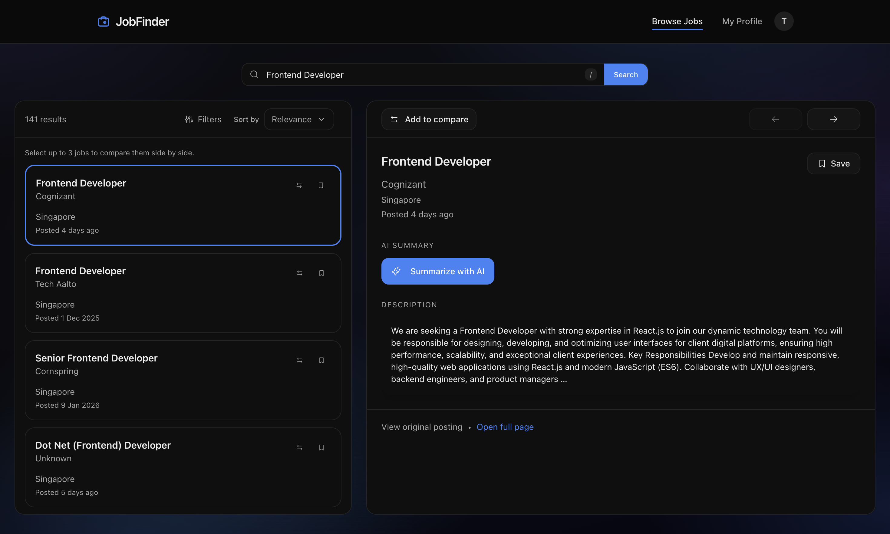

# Job Finder App

AI-assisted job search built with Next.js. Browse listings from the Adzuna API, save jobs,
compare up to 3 roles side by side, and generate AI summaries powered by Gemini.
Admins manage users, listings, and summaries from a dedicated dashboard.



## Tech Stack

| Layer             | Technology                                                                  |
| ----------------- | --------------------------------------------------------------------------- |
| **Framework**     | Next.js 16 (App Router), React 19, TypeScript                               |
| **Database**      | MongoDB + Mongoose                                                          |
| **Data fetching** | TanStack Query (React Query)                                                |
| **Validation**    | Zod (shared schemas in `packages/schemas`)                                  |
| **UI**            | Tailwind CSS 4.0 (dark mode default), shadcn/ui (`packages/ui`)             |
| **Icons**         | @phosphor-icons/react                                                       |
| **Animations**    | framer-motion                                                               |
| **AI**            | Google Gemini (via `ai` SDK) — summaries, resume parsing, skill suggestions |
| **External data** | Adzuna API — job listings for 20+ countries                                 |

## Monorepo layout

```
Job-Finder-App/
├── next-app/             # Next.js application
│   ├── app/              #   Pages and API routes (App Router)
│   ├── components/       #   React components
│   ├── contexts/         #   AuthContext, CompareContext
│   ├── hooks/            #   useSavedListings, useIsMdViewport
│   └── lib/              #   Services, models, API client, auth, utilities
├── packages/
│   ├── schemas/          # Shared Zod schemas and inferred TypeScript types
│   └── ui/               # Shared UI components (Button, Card, Dialog, Input, Label, Select)
└── package.json          # Root workspace config (pnpm + Turborepo)
```

## High-level React component tree

```
RootLayout                          # app/layout.tsx — fonts, metadata
└── Providers                       # QueryClient, AuthProvider, CompareProvider, Toaster
    ├── AuthModal                   # Global overlay — renders when URL has ?auth=login|signup
    │   ├── AuthTabs                #   Log in / Sign up tab bar
    │   └── AuthFormFields          #   Shared form fields (email, password, username)
    │
    ├── / (Home)                    # Server component: redirect() → /browse (preserves auth/redirect params)
    │
    ├── /browse                     # Main job search page
    │   └── ProtectedRoute (blockAdmins)
    │       ├── AppHeader           #   Logo, nav links, UserMenu or AuthModalLink
    │       ├── CompareBar          #   Sticky bar when 1–3 jobs selected for comparison
    │       ├── ListingSection[]    #   → ListingCarousel → ListingCard[] (Recommended, Trending)
    │       ├── ListingCard[]       #   Search results grid
    │       └── JobDetailPanel      #   Right panel (lg) or full-page detail
    │           └── AISummaryCard   #     AI summary output
    │
    ├── /browse/[id]                # Full-page job detail
    │   └── ProtectedRoute (blockAdmins)
    │       ├── AppHeader
    │       ├── CompareBar
    │       └── JobDetailPanel → AISummaryCard
    │
    ├── /browse/compare             # Side-by-side comparison (2–3 jobs)
    │   └── ProtectedRoute (blockAdmins)
    │       ├── AppHeader
    │       ├── CompareBar
    │       └── PageShell
    │           └── CompareColumn[] #   Per-job: meta, description, inline summary
    │
    ├── /summarize                  # Paste URL or text → AI summary
    │   └── ProtectedRoute
    │       └── PageShell → AISummaryCard
    │
    ├── /profile                    # User skills + saved listings (/saved, /my-jobs redirect here)
    │   └── ProtectedRoute (blockAdmins)
    │       ├── AppHeader
    │       ├── SkillsEditor
    │       └── ListingCard[]       #   Saved listings
    │
    ├── /profile/settings           # Account form + delete account
    │   └── ProtectedRoute
    │       ├── AppHeader
    │       └── AccountSettingsForm
    │
    ├── /admin                      # Admin dashboard or login/register
    │   └── AdminLayout
    │       ├── AppHeader (admin nav: Dashboard, Users, Summaries, Listings)
    │       └── Dashboard cards / AuthCard (when not logged in)
    │
    ├── /admin/users                # User management table
    │   └── PageShell → TablePagination, FormField
    │
    ├── /admin/summaries            # Summary moderation table
    │   └── PageShell → TablePagination
    │
    ├── /admin/listings             # Listings management + ListingForm
    │   └── PageShell → ListingCard[], ListingForm, TablePagination
    │
    └── /admin/settings             # Admin account form
        └── PageShell → AccountSettingsForm
```

**Shared components** used across multiple pages: `AppHeader`, `ListingCard`, `ListingCarousel`, `ListingSection`, `SkillsEditor`, `AccountSettingsForm`, `PageShell`, `PageLoading`/`PageError`, `CompareBar`, `AISummaryCard`, `AuthFormFields`, `FormField`, `TablePagination`, `AdminTable`, `ProtectedRoute`.

## API routes

All routes are under `/api/v1/`. Protected routes require a Bearer token; admin routes also require `role: "admin"`.

| Route                      | Methods          | Auth   | Description                                       |
| -------------------------- | ---------------- | ------ | ------------------------------------------------- |
| `/auth/login`              | POST             | —      | Log in (email or username + password)             |
| `/auth/register`           | POST             | —      | Create account                                    |
| `/auth/refresh`            | POST             | Cookie | Rotate access + refresh tokens                    |
| `/auth/logout`             | POST             | —      | Clear refresh cookie                              |
| `/auth/admin/register`     | POST             | Admin  | Create admin user                                 |
| `/users`                   | GET              | Admin  | List users                                        |
| `/users/me`                | GET              | Auth   | Current user                                      |
| `/users/:id`               | GET, PATCH, DELETE | Auth   | User by ID (own or admin); DELETE = delete own account |
| `/profile`                 | GET, PUT         | Auth   | User profile (skills, job titles, resume summary) |
| `/profile/suggest-skills`  | POST             | Auth   | AI skill suggestions from role                    |
| `/resume/parse`            | POST             | Auth   | Parse resume (PDF, DOCX, or text) via AI          |
| `/listings`                | GET              | —      | Search listings (keyword, country, filters)       |
| `/listings/:id`            | GET              | —      | Single listing                                    |
| `/listings/:id/view`       | POST             | —      | Record a view                                     |
| `/listings/categories`     | GET              | —      | Categories by country                             |
| `/listings/trending`       | GET              | —      | Trending listings                                 |
| `/listings/recommended`    | GET              | Auth   | Recommended listings                              |
| `/saved`                   | GET              | Auth   | Saved listings                                    |
| `/saved/:listingId`        | DELETE           | Auth   | Unsave a listing                                  |
| `/saved/check`             | GET              | Auth   | Check if listings are saved                       |
| `/summaries`               | GET, POST        | Auth   | List / create AI summary                          |
| `/summaries/:id`           | GET, DELETE      | Auth   | Get / delete summary                              |
| `/summaries/compare`       | POST             | Auth   | Compare 2–3 listings via AI                       |
| `/summaries/stream`        | POST             | Auth   | Stream AI summary via SSE                         |
| `/admin/dashboard`         | GET              | Admin  | Dashboard metrics                                 |
| `/admin/dashboard/summary` | GET              | Admin  | AI dashboard summary                              |
| `/admin/users`             | GET              | Admin  | User management                                   |
| `/admin/users/:id`         | GET, PATCH       | Admin  | User detail                                       |
| `/admin/users/:id/role`    | PATCH            | Admin  | Change user role                                  |
| `/admin/users/:id/status`  | PATCH            | Admin  | Suspend / activate                                |
| `/admin/summaries`         | GET              | Admin  | All summaries                                     |
| `/admin/summaries/:id`     | DELETE           | Admin  | Delete summary by ID                              |
| `/admin/listings`          | GET, POST, PATCH | Admin  | Listing management                                |
| `/admin/export/data`       | POST             | Admin  | Export data                                       |
| `/admin/system/health`     | GET              | Admin  | System health check                               |

## Database schemas

MongoDB collections (Mongoose models in `next-app/lib/models/`). Zod schemas in `packages/schemas` define the contract; Mongoose schemas align with them.

### User

| Field     | Type                        | Optional                  |
| --------- | --------------------------- | ------------------------- |
| email     | String                      | no                        |
| username  | String                      | no                        |
| password  | String                      | no                        |
| role      | `"user"` \| `"admin"`       | yes (default: `"user"`)   |
| status    | `"active"` \| `"suspended"` | yes (default: `"active"`) |
| createdAt | Date                        | no (auto)                 |
| updatedAt | Date                        | no (auto)                 |

Index: `email` + `role` (unique).

### UserProfile

| Field             | Type                 | Optional            |
| ----------------- | -------------------- | ------------------- |
| userId            | ObjectId (ref: User) | no                  |
| skills            | String[]             | yes (default: `[]`) |
| jobTitles         | String[]             | yes (default: `[]`) |
| resumeSummary     | String               | yes                 |
| yearsOfExperience | Number               | yes                 |
| updatedAt         | Date                 | no (auto)           |

### Listing

| Field       | Type   | Optional                  |
| ----------- | ------ | ------------------------- |
| title       | String | no                        |
| company     | String | no                        |
| location    | String | yes                       |
| description | String | yes                       |
| source      | String | yes (default: `"adzuna"`) |
| sourceUrl   | String | yes                       |
| sourceId    | String | no                        |
| country     | String | no (default: `"sg"`)      |
| expiresAt   | Date   | no                        |
| postedAt    | Date   | yes                       |
| salaryMin   | Number | yes                       |
| salaryMax   | Number | yes                       |
| createdAt   | Date   | no (auto)                 |
| updatedAt   | Date   | no (auto)                 |

Indexes: `sourceId` + `country` (unique); TTL on `expiresAt`.

### SearchCache

| Field      | Type                      | Optional        |
| ---------- | ------------------------- | --------------- |
| cacheKey   | String                    | no              |
| listingIds | ObjectId[] (ref: Listing) | yes             |
| totalCount | Number                    | no (default: 0) |
| expiresAt  | Date                      | no              |
| createdAt  | Date                      | no (auto)       |

Indexes: `cacheKey` (unique); TTL on `expiresAt`.

### AISummary

| Field               | Type                                            | Optional  |
| ------------------- | ----------------------------------------------- | --------- |
| userId              | ObjectId (ref: User)                            | no        |
| inputTextHash       | String                                          | no        |
| tldr                | String                                          | no        |
| keyResponsibilities | String[]                                        | yes       |
| requirements        | String[]                                        | yes       |
| niceToHaves         | String[]                                        | yes       |
| salarySgd           | String                                          | yes       |
| jdMatch             | { matchScore?, matchedSkills?, missingSkills? } | yes       |
| caveats             | String[]                                        | yes       |
| createdAt           | Date                                            | no (auto) |
| updatedAt           | Date                                            | no (auto) |

Indexes: `inputTextHash` + `userId`; `userId`.

### SavedListing

| Field     | Type                    | Optional  |
| --------- | ----------------------- | --------- |
| userId    | ObjectId (ref: User)    | no        |
| listingId | ObjectId (ref: Listing) | no        |
| title     | String                  | no        |
| company   | String                  | no        |
| location  | String                  | yes       |
| sourceUrl | String                  | yes       |
| country   | String                  | yes       |
| createdAt | Date                    | no (auto) |
| updatedAt | Date                    | no (auto) |

Index: `userId` + `listingId` (unique).

### ListingView

| Field     | Type                    | Optional          |
| --------- | ----------------------- | ----------------- |
| listingId | ObjectId (ref: Listing) | no                |
| viewedAt  | Date                    | no (default: now) |

Indexes: `listingId` + `viewedAt`; `viewedAt`.

## Useful scripts

| Command      | Description                  |
| ------------ | ---------------------------- |
| `pnpm dev`   | Start Next.js dev server     |
| `pnpm build` | Build all workspace packages |
| `pnpm lint`  | Lint all workspace packages  |
| `pnpm test`  | Run unit tests (vitest)      |

## Getting started

1. Install dependencies:
   ```bash
   pnpm install
   ```
2. Configure environment variables:
   ```bash
   cp next-app/.env.example next-app/.env.local
   ```
   Edit `next-app/.env.local` with real values:
   - `MONGODB_URI` — MongoDB connection string (must be running and reachable)
   - `JWT_SECRET` and `JWT_REFRESH_SECRET` — at least 32 characters each
   - `ADZUNA_APP_ID` and `ADZUNA_APP_KEY` — for job listings (get from [developer.adzuna.com](https://developer.adzuna.com/signup))
   - `GEMINI_API_KEY` — for AI summaries and resume parsing (get from [ai.google.dev](https://ai.google.dev/))
3. Run the app:
   ```bash
   pnpm dev
   ```
   Open [http://localhost:3000](http://localhost:3000) — you'll be redirected to `/browse`.

## Next steps

- Add screenshot or logo after deployment
- WCAG contrast audit across all pages
- Additional unit and integration tests for services and API routes
